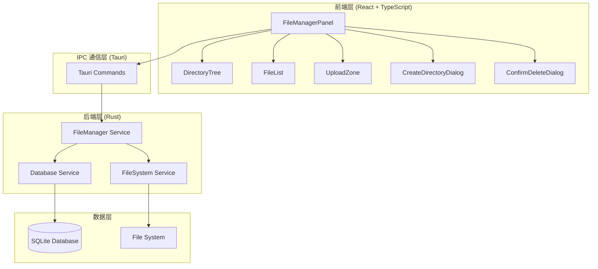
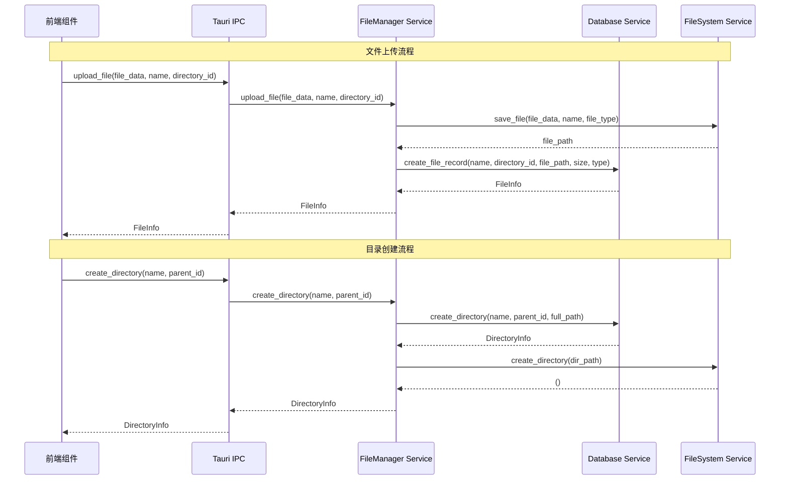

# 文件管理系统架构设计文档

## 整体架构图



## 分层设计

### 1. 前端表现层

#### 1.1 主要组件

**FileManagerPanel.tsx**
```typescript
/**
 * 文件管理主面板组件
 * 负责整体布局和状态管理
 */
interface FileManagerPanelProps {
  isVisible: boolean;
}

interface FileManagerState {
  directories: DirectoryNode[];
  currentDirectory: DirectoryInfo | null;
  files: FileInfo[];
  selectedItems: (DirectoryInfo | FileInfo)[];
  isLoading: boolean;
  error: string | null;
}
```

**DirectoryTree.tsx**
```typescript
/**
 * 目录树组件
 * 显示层级目录结构，支持展开/折叠
 */
interface DirectoryTreeProps {
  directories: DirectoryNode[];
  selectedDirectory: DirectoryInfo | null;
  onDirectorySelect: (directory: DirectoryInfo) => void;
  onDirectoryCreate: (parentId: number | null) => void;
  onDirectoryDelete: (directory: DirectoryInfo) => void;
}
```

**FileList.tsx**
```typescript
/**
 * 文件列表组件
 * 显示当前目录下的文件，支持选择和操作
 */
interface FileListProps {
  files: FileInfo[];
  selectedFiles: FileInfo[];
  onFileSelect: (files: FileInfo[]) => void;
  onFileDelete: (file: FileInfo) => void;
}
```

**UploadZone.tsx**
```typescript
/**
 * 文件上传区域组件
 * 支持拖拽上传和点击选择文件
 */
interface UploadZoneProps {
  directoryId: number;
  onUploadComplete: (files: FileInfo[]) => void;
  onUploadError: (error: string) => void;
}
```

#### 1.2 状态管理策略

```typescript
// 使用 React Context 进行状态管理
const FileManagerContext = createContext<{
  state: FileManagerState;
  actions: {
    loadDirectoryTree: () => Promise<void>;
    selectDirectory: (directory: DirectoryInfo) => void;
    createDirectory: (name: string, parentId?: number) => Promise<void>;
    deleteDirectory: (id: number) => Promise<void>;
    uploadFiles: (files: File[], directoryId: number) => Promise<void>;
    deleteFile: (id: number) => Promise<void>;
  };
}>({} as any);
```

### 2. IPC 通信层

#### 2.1 Tauri 命令接口

```rust
// 目录操作命令
#[tauri::command]
async fn init_file_manager() -> Result<(), String>

#[tauri::command]
async fn get_directory_tree() -> Result<Vec<DirectoryNode>, String>

#[tauri::command]
async fn create_directory(name: String, parent_id: Option<i64>) -> Result<DirectoryInfo, String>

#[tauri::command]
async fn delete_directory(id: i64) -> Result<(), String>

// 文件操作命令
#[tauri::command]
async fn upload_file(
    file_data: Vec<u8>,
    file_name: String,
    directory_id: i64
) -> Result<FileInfo, String>

#[tauri::command]
async fn delete_file(id: i64) -> Result<(), String>

#[tauri::command]
async fn get_files_in_directory(directory_id: i64) -> Result<Vec<FileInfo>, String>
```

### 3. 后端服务层

#### 3.1 FileManager Service

```rust
/**
 * 文件管理服务
 * 协调数据库和文件系统操作
 */
pub struct FileManagerService {
    db_service: DatabaseService,
    fs_service: FileSystemService,
    app_data_dir: PathBuf,
}

impl FileManagerService {
    pub async fn new(app_handle: &AppHandle) -> Result<Self, Box<dyn std::error::Error>>
    pub async fn init_storage(&self) -> Result<(), Box<dyn std::error::Error>>
    pub async fn create_directory(&self, name: &str, parent_id: Option<i64>) -> Result<DirectoryInfo, Box<dyn std::error::Error>>
    pub async fn delete_directory(&self, id: i64) -> Result<(), Box<dyn std::error::Error>>
    pub async fn upload_file(&self, file_data: &[u8], name: &str, directory_id: i64) -> Result<FileInfo, Box<dyn std::error::Error>>
    pub async fn delete_file(&self, id: i64) -> Result<(), Box<dyn std::error::Error>>
}
```

#### 3.2 Database Service

```rust
/**
 * 数据库服务
 * 负责 SQLite 数据库操作
 */
pub struct DatabaseService {
    connection: Arc<Mutex<rusqlite::Connection>>,
}

impl DatabaseService {
    pub fn new(db_path: &Path) -> Result<Self, rusqlite::Error>
    pub fn init_tables(&self) -> Result<(), rusqlite::Error>
    
    // 目录操作
    pub fn create_directory(&self, name: &str, parent_id: Option<i64>, full_path: &str) -> Result<DirectoryInfo, rusqlite::Error>
    pub fn get_directory_tree(&self) -> Result<Vec<DirectoryNode>, rusqlite::Error>
    pub fn delete_directory(&self, id: i64) -> Result<(), rusqlite::Error>
    
    // 文件操作
    pub fn create_file_record(&self, name: &str, directory_id: i64, file_path: &str, file_size: i64, file_type: &str) -> Result<FileInfo, rusqlite::Error>
    pub fn get_files_in_directory(&self, directory_id: i64) -> Result<Vec<FileInfo>, rusqlite::Error>
    pub fn delete_file_record(&self, id: i64) -> Result<String, rusqlite::Error> // 返回文件路径用于删除实际文件
}
```

#### 3.3 FileSystem Service

```rust
/**
 * 文件系统服务
 * 负责实际的文件 I/O 操作
 */
pub struct FileSystemService {
    files_dir: PathBuf,
}

impl FileSystemService {
    pub fn new(files_dir: PathBuf) -> Self
    pub async fn init_directories(&self) -> Result<(), std::io::Error>
    
    pub async fn save_file(&self, file_data: &[u8], file_name: &str, file_type: &str) -> Result<String, std::io::Error>
    pub async fn delete_file(&self, file_path: &str) -> Result<(), std::io::Error>
    pub async fn create_directory(&self, dir_path: &str) -> Result<(), std::io::Error>
    pub async fn delete_directory(&self, dir_path: &str) -> Result<(), std::io::Error>
    
    fn generate_unique_filename(&self, original_name: &str, file_type: &str) -> String
    fn get_file_type_dir(&self, file_type: &str) -> PathBuf
}
```

## 核心组件详细设计

### 1. 数据模型

```rust
#[derive(Debug, Clone, Serialize, Deserialize)]
pub struct DirectoryInfo {
    pub id: i64,
    pub name: String,
    pub parent_id: Option<i64>,
    pub full_path: String,
    pub created_at: String,
}

#[derive(Debug, Clone, Serialize, Deserialize)]
pub struct FileInfo {
    pub id: i64,
    pub name: String,
    pub directory_id: i64,
    pub file_path: String,
    pub file_size: i64,
    pub file_type: String,
    pub created_at: String,
    pub modified_at: String,
}

#[derive(Debug, Clone, Serialize, Deserialize)]
pub struct DirectoryNode {
    pub info: DirectoryInfo,
    pub children: Vec<DirectoryNode>,
    pub file_count: usize,
}
```

### 2. 错误处理策略

```rust
#[derive(Debug, thiserror::Error)]
pub enum FileManagerError {
    #[error("Database error: {0}")]
    Database(#[from] rusqlite::Error),
    
    #[error("File system error: {0}")]
    FileSystem(#[from] std::io::Error),
    
    #[error("Directory not found: {id}")]
    DirectoryNotFound { id: i64 },
    
    #[error("File not found: {id}")]
    FileNotFound { id: i64 },
    
    #[error("Directory not empty: {name}")]
    DirectoryNotEmpty { name: String },
    
    #[error("Invalid file type: {file_type}")]
    InvalidFileType { file_type: String },
}
```

### 3. 配置管理

```rust
#[derive(Debug, Serialize, Deserialize)]
pub struct FileManagerConfig {
    pub max_file_size: u64,        // 最大文件大小 (bytes)
    pub allowed_file_types: Vec<String>, // 允许的文件类型
    pub files_dir: String,         // 文件存储目录
    pub database_file: String,     // 数据库文件名
}

impl Default for FileManagerConfig {
    fn default() -> Self {
        Self {
            max_file_size: 50 * 1024 * 1024, // 50MB
            allowed_file_types: vec![
                "image/png".to_string(),
                "image/jpeg".to_string(),
                "image/gif".to_string(),
                "image/webp".to_string(),
            ],
            files_dir: "files".to_string(),
            database_file: "file_manager.db".to_string(),
        }
    }
}
```

## 接口契约定义

### 1. 前端 TypeScript 接口

```typescript
// API 调用接口
interface FileManagerAPI {
  initFileManager(): Promise<void>;
  getDirectoryTree(): Promise<DirectoryNode[]>;
  createDirectory(name: string, parentId?: number): Promise<DirectoryInfo>;
  deleteDirectory(id: number): Promise<void>;
  uploadFile(fileData: Uint8Array, fileName: string, directoryId: number): Promise<FileInfo>;
  deleteFile(id: number): Promise<void>;
  getFilesInDirectory(directoryId: number): Promise<FileInfo[]>;
}

// 组件 Props 接口
interface DirectoryTreeNodeProps {
  node: DirectoryNode;
  level: number;
  isSelected: boolean;
  onSelect: (directory: DirectoryInfo) => void;
  onCreateChild: (parentId: number) => void;
  onDelete: (directory: DirectoryInfo) => void;
}

interface FileItemProps {
  file: FileInfo;
  isSelected: boolean;
  onSelect: (file: FileInfo) => void;
  onDelete: (file: FileInfo) => void;
}
```

### 2. 后端 Rust 接口

```rust
// Service 特征定义
#[async_trait]
pub trait FileManagerServiceTrait {
    async fn init_storage(&self) -> Result<(), FileManagerError>;
    async fn create_directory(&self, name: &str, parent_id: Option<i64>) -> Result<DirectoryInfo, FileManagerError>;
    async fn delete_directory(&self, id: i64) -> Result<(), FileManagerError>;
    async fn get_directory_tree(&self) -> Result<Vec<DirectoryNode>, FileManagerError>;
    async fn upload_file(&self, file_data: &[u8], name: &str, directory_id: i64) -> Result<FileInfo, FileManagerError>;
    async fn delete_file(&self, id: i64) -> Result<(), FileManagerError>;
    async fn get_files_in_directory(&self, directory_id: i64) -> Result<Vec<FileInfo>, FileManagerError>;
}
```

## 数据流向图



## 异常处理策略

### 1. 错误分类和处理

```rust
// 错误处理中间件
pub fn handle_file_manager_error(error: FileManagerError) -> String {
    match error {
        FileManagerError::Database(db_err) => {
            log::error!("Database error: {}", db_err);
            "数据库操作失败，请重试".to_string()
        },
        FileManagerError::FileSystem(fs_err) => {
            log::error!("File system error: {}", fs_err);
            "文件操作失败，请检查磁盘空间".to_string()
        },
        FileManagerError::DirectoryNotFound { id } => {
            log::warn!("Directory not found: {}", id);
            "目录不存在".to_string()
        },
        FileManagerError::DirectoryNotEmpty { name } => {
            log::warn!("Directory not empty: {}", name);
            format!("目录 '{}' 不为空，无法删除", name)
        },
        _ => "未知错误".to_string(),
    }
}
```

### 2. 前端错误处理

```typescript
// 错误处理 Hook
const useErrorHandler = () => {
  const showError = (error: string) => {
    // 使用 Toast 显示错误信息
    toast.error(error);
  };
  
  const handleAsyncError = async <T>(operation: () => Promise<T>): Promise<T | null> => {
    try {
      return await operation();
    } catch (error) {
      showError(error as string);
      return null;
    }
  };
  
  return { showError, handleAsyncError };
};
```

## 性能优化策略

### 1. 数据库优化
- 使用索引加速查询
- 批量操作减少数据库连接
- 连接池管理

### 2. 文件系统优化
- 异步 I/O 操作
- 分块上传大文件
- 缓存常用目录信息

### 3. 前端优化
- 虚拟滚动处理大量文件
- 懒加载目录树节点
- 防抖处理用户输入

---

**设计状态**: 架构设计完成
**下一步**: 进入原子化任务拆分阶段