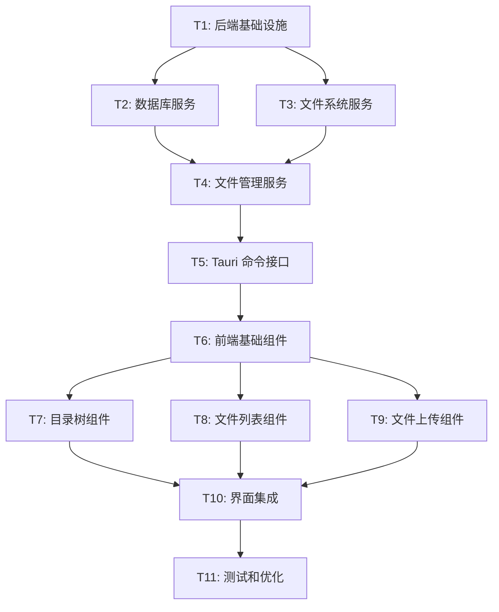

# 文件管理系统原子任务拆分

## 任务依赖图

## 原子任务详细定义

### T1: 后端基础设施搭建

**任务描述**: 设置 Rust 后端的基础架构和依赖

**输入契约**:
- 前置依赖: 现有 Tauri 项目结构
- 输入数据: Cargo.toml 配置
- 环境依赖: Rust 开发环境

**输出契约**:
- 输出数据: 更新的 Cargo.toml 和基础模块结构
- 交付物: 
  - `src-tauri/Cargo.toml` (新增依赖)
  - `src-tauri/src/file_manager/mod.rs`
  - `src-tauri/src/file_manager/error.rs`
  - `src-tauri/src/file_manager/config.rs`
- 验收标准: 项目编译通过，依赖正确安装

**实现约束**:
- 技术栈: Rust, rusqlite, uuid, tokio, serde, chrono
- 接口规范: 遵循现有 Tauri 项目结构
- 质量要求: 所有模块有基础文档注释

**依赖关系**:
- 后置任务: T2, T3
- 并行任务: 无

---

### T2: 数据库服务实现

**任务描述**: 实现 SQLite 数据库操作服务

**输入契约**:
- 前置依赖: T1 完成
- 输入数据: 数据库表结构设计
- 环境依赖: SQLite 支持

**输出契约**:
- 输出数据: 完整的数据库服务模块
- 交付物:
  - `src-tauri/src/file_manager/database.rs`
  - 数据库初始化脚本
  - 基础 CRUD 操作函数
- 验收标准: 
  - 数据库表正确创建
  - 所有 CRUD 操作测试通过
  - 错误处理完整

**实现约束**:
- 技术栈: rusqlite, 事务管理
- 接口规范: 异步操作，返回 Result 类型
- 质量要求: 完整的错误处理和日志记录

**依赖关系**:
- 前置任务: T1
- 后置任务: T4
- 并行任务: T3

---

### T3: 文件系统服务实现

**任务描述**: 实现文件 I/O 操作服务

**输入契约**:
- 前置依赖: T1 完成
- 输入数据: 文件存储策略设计
- 环境依赖: 文件系统访问权限

**输出契约**:
- 输出数据: 完整的文件系统服务模块
- 交付物:
  - `src-tauri/src/file_manager/filesystem.rs`
  - 文件上传/下载函数
  - 目录操作函数
- 验收标准:
  - 文件保存和删除功能正常
  - 目录创建和删除功能正常
  - 文件类型检测准确

**实现约束**:
- 技术栈: tokio::fs, std::path
- 接口规范: 异步操作，支持大文件处理
- 质量要求: 完整的权限检查和错误处理

**依赖关系**:
- 前置任务: T1
- 后置任务: T4
- 并行任务: T2

---

### T4: 文件管理服务实现

**任务描述**: 实现核心文件管理业务逻辑

**输入契约**:
- 前置依赖: T2, T3 完成
- 输入数据: 数据库和文件系统服务接口
- 环境依赖: 应用数据目录访问权限

**输出契约**:
- 输出数据: 完整的文件管理服务
- 交付物:
  - `src-tauri/src/file_manager/service.rs`
  - 目录管理功能
  - 文件管理功能
  - 服务初始化逻辑
- 验收标准:
  - 所有业务逻辑功能正常
  - 数据一致性保证
  - 事务处理正确

**实现约束**:
- 技术栈: 组合 T2 和 T3 的服务
- 接口规范: 高级业务接口，隐藏底层实现
- 质量要求: 完整的业务逻辑测试

**依赖关系**:
- 前置任务: T2, T3
- 后置任务: T5
- 并行任务: 无

---

### T5: Tauri 命令接口实现

**任务描述**: 实现前后端通信的 Tauri 命令

**输入契约**:
- 前置依赖: T4 完成
- 输入数据: 文件管理服务接口
- 环境依赖: Tauri 运行环境

**输出契约**:
- 输出数据: 完整的 Tauri 命令集
- 交付物:
  - `src-tauri/src/file_manager/commands.rs`
  - 更新的 `src-tauri/src/lib.rs`
  - 所有前端需要的 API 命令
- 验收标准:
  - 所有命令可以从前端正常调用
  - 参数验证和错误处理完整
  - 返回数据格式正确

**实现约束**:
- 技术栈: Tauri 命令宏，serde 序列化
- 接口规范: RESTful 风格的命令设计
- 质量要求: 完整的参数验证和错误转换

**依赖关系**:
- 前置任务: T4
- 后置任务: T6
- 并行任务: 无

---

### T6: 前端基础组件实现

**任务描述**: 实现前端基础组件和类型定义

**输入契约**:
- 前置依赖: T5 完成
- 输入数据: Tauri 命令接口定义
- 环境依赖: React 开发环境

**输出契约**:
- 输出数据: 前端基础架构
- 交付物:
  - `src/types/fileManager.ts`
  - `src/hooks/useFileManager.ts`
  - `src/services/fileManagerAPI.ts`
  - `src/components/FileManager/FileManagerPanel.tsx`
- 验收标准:
  - TypeScript 类型定义完整
  - API 调用函数正常工作
  - 基础组件可以渲染

**实现约束**:
- 技术栈: React, TypeScript, Tauri API
- 接口规范: 遵循现有组件设计模式
- 质量要求: 完整的 TypeScript 类型安全

**依赖关系**:
- 前置任务: T5
- 后置任务: T7, T8, T9
- 并行任务: 无

---

### T7: 目录树组件实现

**任务描述**: 实现可交互的目录树组件

**输入契约**:
- 前置依赖: T6 完成
- 输入数据: 基础组件和 API 服务
- 环境依赖: React 组件环境

**输出契约**:
- 输出数据: 完整的目录树组件
- 交付物:
  - `src/components/FileManager/DirectoryTree.tsx`
  - `src/components/FileManager/DirectoryTreeNode.tsx`
  - `src/components/FileManager/CreateDirectoryDialog.tsx`
- 验收标准:
  - 目录树正确显示层级结构
  - 支持展开/折叠操作
  - 支持创建和删除目录
  - 选中状态正确显示

**实现约束**:
- 技术栈: React, Tailwind CSS, Heroicons
- 接口规范: 遵循 Eagle 风格设计
- 质量要求: 响应式设计，良好的用户体验

**依赖关系**:
- 前置任务: T6
- 后置任务: T10
- 并行任务: T8, T9

---

### T8: 文件列表组件实现

**任务描述**: 实现文件列表显示和操作组件

**输入契约**:
- 前置依赖: T6 完成
- 输入数据: 基础组件和 API 服务
- 环境依赖: React 组件环境

**输出契约**:
- 输出数据: 完整的文件列表组件
- 交付物:
  - `src/components/FileManager/FileList.tsx`
  - `src/components/FileManager/FileItem.tsx`
  - `src/components/FileManager/ConfirmDeleteDialog.tsx`
- 验收标准:
  - 文件列表正确显示
  - 支持文件选择操作
  - 支持文件删除操作
  - 文件信息显示完整

**实现约束**:
- 技术栈: React, Tailwind CSS, 文件图标
- 接口规范: 网格或列表视图
- 质量要求: 支持大量文件的性能优化

**依赖关系**:
- 前置任务: T6
- 后置任务: T10
- 并行任务: T7, T9

---

### T9: 文件上传组件实现

**任务描述**: 实现拖拽上传和文件选择组件

**输入契约**:
- 前置依赖: T6 完成
- 输入数据: 基础组件和 API 服务
- 环境依赖: React 组件环境，文件 API 支持

**输出契约**:
- 输出数据: 完整的文件上传组件
- 交付物:
  - `src/components/FileManager/UploadZone.tsx`
  - `src/components/FileManager/UploadProgress.tsx`
  - 文件类型验证逻辑
- 验收标准:
  - 支持拖拽上传
  - 支持点击选择文件
  - 上传进度显示
  - 文件类型和大小验证

**实现约束**:
- 技术栈: React, HTML5 File API, react-dropzone
- 接口规范: 现代化的上传体验
- 质量要求: 错误处理和用户反馈完整

**依赖关系**:
- 前置任务: T6
- 后置任务: T10
- 并行任务: T7, T8

---

### T10: 界面集成

**任务描述**: 将文件管理功能集成到现有界面中

**输入契约**:
- 前置依赖: T7, T8, T9 完成
- 输入数据: 所有前端组件
- 环境依赖: 现有 Sidebar 组件

**输出契约**:
- 输出数据: 集成的文件管理界面
- 交付物:
  - 更新的 `src/components/Sidebar.tsx`
  - 更新的 `src/App.tsx`
  - 样式调整和主题适配
- 验收标准:
  - 文件管理标签页正确显示
  - 界面风格与现有设计一致
  - 功能切换正常工作
  - 响应式布局适配

**实现约束**:
- 技术栈: 现有的 React 组件架构
- 接口规范: 保持现有界面的一致性
- 质量要求: 无破坏性变更，向后兼容

**依赖关系**:
- 前置任务: T7, T8, T9
- 后置任务: T11
- 并行任务: 无

---

### T11: 测试和优化

**任务描述**: 进行全面测试和性能优化

**输入契约**:
- 前置依赖: T10 完成
- 输入数据: 完整的文件管理系统
- 环境依赖: 测试环境和工具

**输出契约**:
- 输出数据: 经过测试和优化的系统
- 交付物:
  - 测试用例和测试报告
  - 性能优化报告
  - 用户使用文档
- 验收标准:
  - 所有功能测试通过
  - 性能指标达到要求
  - 错误处理覆盖完整
  - 用户体验良好

**实现约束**:
- 技术栈: 现有测试工具
- 接口规范: 符合验收标准
- 质量要求: 生产环境就绪

**依赖关系**:
- 前置任务: T10
- 后置任务: 无
- 并行任务: 无

## 任务执行计划

### 第一阶段：后端基础 (T1-T4)
**预计时间**: 2-3 天
**关键里程碑**: 后端服务完全可用

### 第二阶段：接口层 (T5-T6)
**预计时间**: 1-2 天
**关键里程碑**: 前后端通信建立

### 第三阶段：前端组件 (T7-T9)
**预计时间**: 2-3 天
**关键里程碑**: 所有核心组件完成

### 第四阶段：集成和测试 (T10-T11)
**预计时间**: 1-2 天
**关键里程碑**: 系统完整可用

## 风险评估

### 高风险任务
- **T2 数据库服务**: SQLite 并发处理复杂
- **T9 文件上传组件**: 大文件处理和错误恢复

### 中风险任务
- **T4 文件管理服务**: 业务逻辑复杂度
- **T10 界面集成**: 可能影响现有功能

### 低风险任务
- **T1 基础设施**: 标准配置任务
- **T6 基础组件**: 标准 React 开发

## 质量保证

### 每个任务的质量检查点
1. **代码审查**: 所有代码符合项目规范
2. **功能测试**: 核心功能正常工作
3. **错误处理**: 异常情况有适当处理
4. **文档更新**: 相关文档同步更新
5. **性能检查**: 满足性能要求

---

**任务拆分状态**: 完成
**总任务数**: 11 个原子任务
**预计总时间**: 6-10 天
**下一步**: 进入审批阶段